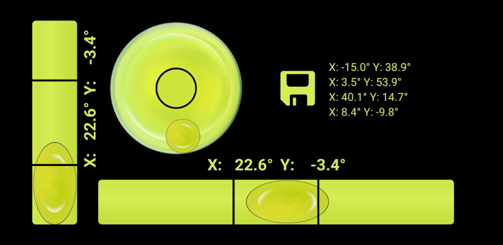
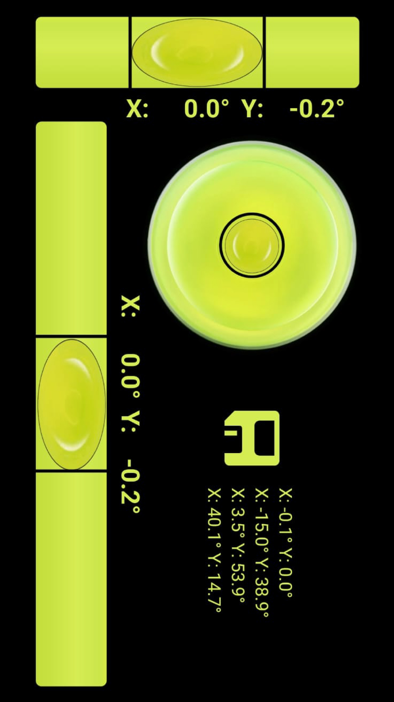

# Wasserwaage – React Native App

Dies ist eine einfache Wasserwaagen-App, entwickelt mit React Native und Expo.  
Die App nutzt den Beschleunigungssensor des Smartphones, um horizontale oder vertikale Ausrichtung zu erkennen.

## Entwickler
Stefan Kempter

## Funktionen

- Echtzeit-Anzeige der Neigungswinkel
- Speicherung von bis zu vier Referenzwerten
- Anpassung der Anzeige an verschiedene Bildschirmgrößen
- Eigenständig entwickelt, von der Idee bis zum Build für Android

## Screenshots

## Hinweis

**Eine Nutzung, Vervielfältigung oder Weiterverbreitung der Inhalte, insbesondere des Quellcodes und der Assets, ist ohne ausdrückliche Genehmigung nicht gestattet.**

© 2025 Stefan Kempter. All rights reserved.

